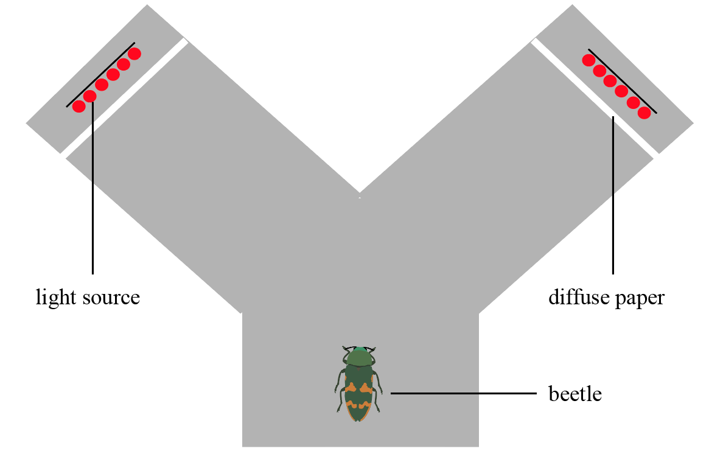

# The aim

Intracellular recordings, opsin expression and electroretinogram data indicate that jewel beetles have a LWS photoreceptor with sensitivity potentially extending into the far red. However, their visual sensitivities have not been confirmed with behavioural data. Here, we conducted a behavioral assay to confirm their long wavelength sensitivity in living jewel beetles.

</br>
</br>

# Materials and methods

To test the behavioural response of jewel beetles to long wavelengths, we conducted bi-choice behavioural experiments based on their positive phototaxis. We used a neutral-grey Y-maze as an arena (10 cm high; two 15 cm wide x 20 cm long arms with a 20 cm wide x 15 cm long base) with a light stimulus at the end of one arm and no stimulus at the end of the other. The lit arm was shifted between trials to prevent bias in arm preference. To create the light stimulus, we used a light panel with 6 LED diodes of the same peak wavelength with a piece of diffuse paper placed 1 cm in front. The peak wavelengths of the diodes used in this experiment ranged from 590 to 735 nm and were performed in the order of: 590, 680, 700, 720, 735, 645 nm. The shorter wavelength in the last trial was to ensure that there was no significant fatigue in beetles after all trials and the responses were reliable. Each beetle was exposed to all light stimuli and received at least 10-minute break between trials. All trials were conducted in a dark room with an indirect dim light.

</br>
</br>

```{r pressure, echo=FALSE, fig.cap="Figure caption: Y-maze setup.", out.width = '70%'}

```
</br>
</br>

Each trial lasted for 3 minutes and started when the beetle was introduced into the base of the Y-maze. We defined a valid choice as the beetle approaching closer than 5 cm to the diffuse paper at the end of the lit arm. If the beetle made a valid choice before 3 minutes, we stopped the trial and recorded the individual as attracted to that wavelength. Otherwise, the trial ended at 3 minutes and a second trial was performed 10 minutes later with same wavelength to ensure the consistency of its response. If the beetle made a valid choice in the second trial, we then recorded the individual as attracted to that wavelength despite its failure in the first trial. If the beetle still failed to make a valid choice in the second trial, we recorded the individual as not attracted to the wavelength (including in the base zone, dark arm, and in the lit arm but not <5 cm to the end). In total, 28 individuals from 2 species (16 *Castiarina dimidiata* and 12 *C. flavopicta*) completed the 6-wavelength trial series. Every trial was video recorded using a camera with night mode.
</br>
</br>
We used the beetles’ responses (attracted / not attracted) in the behavioural trials to obtain a response curve over 590-735 nm by fitting a logistic regression for the 2 species, separately. In the model, we set the response of the beetles as dependent variable, peak wavelength of the light source as a fixed factor, and individual ID as a random factor to account for repeated trials for each individual.
</br>
</br>
For details of beetle collection, please see the main text of the paper.


```{r,warning=FALSE, message=FALSE, results='hide'}
library(lme4)
library(ggplot2)
library(dplyr)
library(pavo)
library(ggpubr)
library(tidyr)
```

```{r setup, include=FALSE}
knitr::opts_chunk$set(warning=FALSE, message=FALSE) # Suppress warnings in the HTML output
knitr::opts_chunk$set(cache=TRUE, warning = F) # set up cacheing to save time when re-building the html document
```

```{r,echo=FALSE,message=FALSE, warning=FALSE}
ymaze <- read.csv("data/behavioura result.csv")
```


```{r,echo=FALSE,message=FALSE, warning=FALSE}
# Castiarina dimidiata (n=16)
# filter the data for this species
ymaze.Cdimidiata <- subset(filter(ymaze, species == "Castiarina_dimidiata" ))
ymaze.Cflavopicta <- subset(filter(ymaze, species == "Castiarina_flavopicta"))

# create the logistic model
ymodel.Cdimidiata <- glmer(attracted ~ wavelength + (1|individual), 
                             family = binomial(link = "logit"), data = ymaze.Cdimidiata)
ymodel.Cflavopicta <- glmer(attracted ~ wavelength + (1|individual), 
                          family = binomial(link="logit"), data = ymaze.Cflavopicta)

#predict the 95 CI
inputdat <- list(ymaze.Cdimidiata, ymaze.Cflavopicta)
predictmodel <- list(ymodel.Cdimidiata, ymodel.Cflavopicta)
newdat_output <- list(Cdimidiata = NA, Cflavopicta = NA)

for (i in 1:length(inputdat)){
  
  idlist <- unique(inputdat[[i]]$individual)
  newdat <- expand.grid(wavelength = 590:735, individual = idlist)
  newdat$attracted <- predict(predictmodel[[i]], newdat ,re.form = NA)
  
  mm <- model.matrix(terms(predictmodel[[i]]), newdat)
  pvar <- diag(mm %*% tcrossprod(vcov(predictmodel[[i]]), mm))
  tvar  <- pvar + VarCorr(predictmodel[[i]])$individual[1]
  cmult <- 1.96
  
  newdat1 <- data.frame(newdat, 
                      plo = plogis(newdat$attracted - cmult*sqrt(pvar)), 
                      phi = plogis(newdat$attracted + cmult*sqrt(pvar))) 
  newdat1$attracted <- plogis(newdat1$attracted)
  
  newdat_output[[i]] <- newdat1

}
```

</br>
</br>

# Behavioural results

Behavioural experiments confirmed far-red sensitivity in both species of jewel beetle. 96% of jewel beetles were attracted by light at 590 nm and c.a. 87% of them still responded to light at 645 nm (*C. dimidiata*: 100% and 96%; *C. flavopicta*, 93% and 78%; at 590 nm and 645 nm). The percentage of the respondents (i.e. those reached <5 cm to the end the lit arm) decreased steadily after 590 nm in *C. flavopicta* down to 735 nm, whereas the decrease is more abrupt in *C. dimidiata* after 680 nm. At 700 nm, *C. dimidiata* and *C. flavopicta* had a response rate of 56% and 39%, respectively. The 50% response rate was at c.a. 704 nm for *C. dimidiata* and c.a. 685 nm for *C. flavopicta*. Only one *C. dimidiata* individual responded to light at 735 nm.
</br>
</br>

```{r, fig.cap="Figure caption: Results of the behavioural experiments on two jewel beetles. Blue represents *Castiarina dimidiata* and yellow represent *C. flavopicta*. Logistic regression lines show beetles’ high response rate at 700 nm. 95 % confidence intervals in shaded regions. The green dashed line shows the mean leaf reflectance spectrum from our dataset."}
ggplot(ymaze, 
       aes(x = wavelength, y = attracted))+
  geom_jitter(data = ymaze.Cflavopicta, 
              height = 0.01, width = 5, alpha = 0.5, size = 3, color = "#ffb700ff")+
  geom_jitter(data = ymaze.Cdimidiata, 
              height = 0.01, width = 5, alpha = 0.5, size = 3, color = "#1c5ab7ff")+
  geom_ribbon(data = newdat_output[[2]], fill = "#FDF0AD", aes(ymax = phi, ymin = plo))+
  geom_ribbon(data = newdat_output[[1]], fill = "#b6d1ff", aes(ymax = phi, ymin = plo))+ 
  geom_line(data = newdat_output[[2]], aes(x = wavelength, y = attracted), color = "#ffb700ff")+
   geom_line(data = newdat_output[[1]], aes(x = wavelength, y = attracted), color = "#1c5ab7ff")+ 
  geom_hline(yintercept = 0.50, linetype = "dotted")+
  scale_x_continuous(breaks = seq(580, 780, by = 20))+
  scale_y_continuous(name = "Attracted rate")+
  xlab("Wavelength (nm)")+
  theme_classic()
```
 
</br>
</br>

# Summary
The behavioural experiment suggests that jewel beetles have long wavelength sensitivity spanning the ‘red edge’.
</br>
</br>

# Supplementary images{.tabset .tabset-fade .tabset-pills}
</br>
</br>

## LED peaks

</br>
</br>

```{r, echo=FALSE, fig.cap="Figure caption: Absolute irradiance of the LED lights used in behavioural trials.", out.width = '70%'}
led.spec <- read.csv("data/LED irradiation.csv",header=TRUE) %>%
  as.rspec(lim = c(300, 800)) %>% 
  procspec(opt = "smooth", # smooth the spec
           span = 0.05) %>% 
  gather(peak,irradiance, -wl)

library(ggsci)
ggplot(led.spec, aes(x = wl, y = irradiance, color = peak))+
  geom_line()+
  scale_color_jco(labels = c("590 nm", "645 nm", "680 nm", "700 nm", "720 nm", "735 nm", "755 nm"))+
  xlab("Wavelength (nm)")+
  ylab("Photon flux (umol.s-1.m-2.nm-1)")+
  theme_classic()
```
## Ambient dim light
```{r, echo=FALSE, fig.cap="Figure caption: The dim light in the environment.", out.width = '70%'}
dim.spec <- read.csv("data/dim spec.csv",header=TRUE) %>%
  procspec(opt = "smooth", # smooth the spec
           span = 0.1, # smoothing level
           fixneg = "zero")# lift the negative values to zero. Likely just noise.

ggplot(dim.spec, aes(x = wl, y = Irradiance)) + 
  ylab("Absolute irradiance (uW.cm-2.nm-1)")+ 
  xlab("Wavelength (nm)")+
  geom_line() + 
  ylim(NA, 0.01)+
  theme(plot.subtitle = element_text(vjust = 1),
        plot.caption = element_text(vjust = 1),
        plot.title = element_text(face="bold")) + 
  theme(axis.line = element_line(size = 0.5, 
                                 linetype = "solid"), 
        panel.grid.major = element_line(linetype = "blank"), 
        panel.grid.minor = element_line(linetype = "blank"), 
        panel.background = element_rect(fill = NA),
        plot.title = element_text(hjust = 0.5),
        plot.subtitle = element_text(hjust = 0.5))
```
