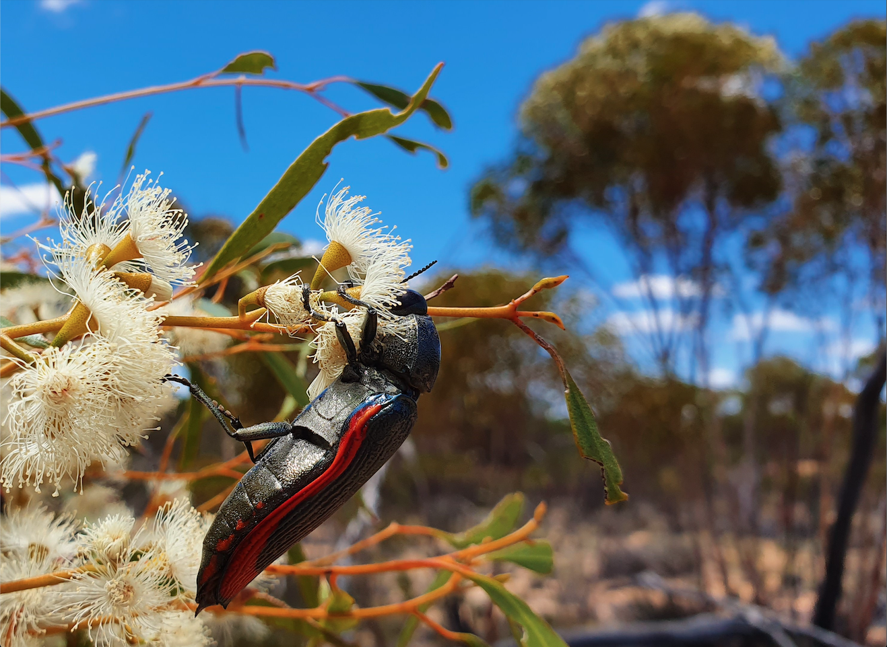

```{r, echo=FALSE, fig.cap = "Figure caption: A jewel beetle feeding on _Eucalyptus_ flowers. Credit: Amanda Franklin.", out.width = '100%'}

```
</br>
</br>

In this online document, we describe the analyses and results of visual models and behavioural assays in the paper "Insect visual sensitivity in the far-red enhances contrast against vegetation". We provide the code for users to run the analyses step-by-step, and produce the figures from the manuscript.

This document is divided into four parts:

1. [Main models](main_models.html) : Shows the main visual models in the paper. Additionally, we combined the models using twilight illumination here for comparison.

2. [Opsin-shifted visual systems](opsin_shifed_models.html) : Ran the same models as in the main models, but used opsin-shifted LWS receptors instead of filter-shifted ones.

3. [Evenly space](evenly_space.html) : Test for the effect of evenly spaced photoreceptors on chromatic contrast.

4. [Sensitivity analysis](sensitivity_analysis.html): Test if the modelling results are sensitive to photoreceptor ratio.

5. [Behavioural assay](behavioural_assay.html): Details about the behavioural assay which we tested if the living jewel beetles could respond to long wavelength light.


