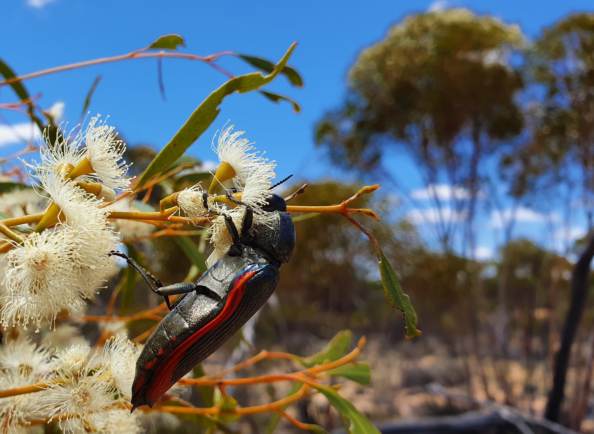

```{r pressure, echo=FALSE, fig.cap="Figure caption: A jewel beetle feeding on _Eucalyptus_ flowers. Credit: Amanda Franklin.", out.width = '100%'}

```
</br>
</br>

In this online document, we visualized the results of visual models and bebaviroual assay in the paper "". We provide the code for the analyses step by step, and hope it is clearer than just providing a R script file for the readers.

This document is divided into four parts:

1. [Main models](main_models.html) : Shows the main visual models in the papepr. Additionally, we combined the models using twilight illumination here for comparison.

2. [Even space](even_space.html) : Test for the effect of even spacing in visual system.

3. [Sensitivity analysis](sensitivity_analysis.html): Test if the modelling results are sensitive to photoreceptor ratio.

4. [Behaviroual assay](behairoual_assay.html): Details about the behaviorual assay which we tested if the living jewel beetles could response to long wavelength light.


